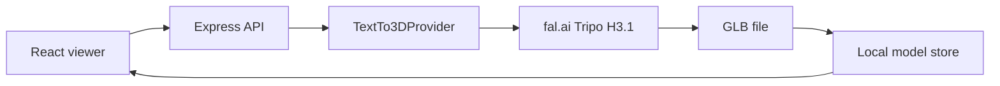

# 3DForge AI

3DForge AI turns a written description into a 3D model you can orbit in the browser and download as a GLB.

The backend sends the prompt to [Tripo H3.1 on fal.ai](https://fal.ai/models/tripo3d/h3.1/text-to-3d), waits for the queued job, stores the generated GLB, and serves it to a React Three Fiber viewer. A separate development mode can load a labeled sample model when you do not have an API key. That sample is never presented as AI output.

## Features

- Prompt validation in the browser and again on the server
- Asynchronous text-to-3D generation with status polling and cancellation
- Interactive viewer: orbit, zoom, pan, reset, auto-rotate, wireframe, grid, background, fullscreen
- Automatic centering and scaling for models of different sizes
- Download of the actual generated `.glb`
- Session history in `localStorage`
- Rate limiting, Helmet, CORS, and centralized errors that do not leak provider secrets

## Demo

Real generation needs a [fal.ai](https://fal.ai) API key in the backend environment. Without that key the API returns a clear configuration error. With `AI_PROVIDER=demo`, the UI loads the Khronos Duck sample and labels it **Development Demo Model**.

## Screenshots

Capture these after the app is running locally:

1. Hero and prompt composer on the dark landing screen
2. Generation status while a model is queued
3. The 3D viewer with a completed model
4. The model information panel and download action
5. The same flow on a narrow viewport

## Architecture



The rest of the backend depends on `TextTo3DProvider`, not on fal-specific types. Replacing the model means adding another class under `backend/src/services/ai/` and selecting it from configuration.

Polling is used instead of fal webhooks. Webhooks need a public HTTPS endpoint and signature checks, which is a poor fit for local development and for hosts that sleep. The browser polls `GET /api/v1/generations/:id` until the job finishes. Each poll asks fal for the real queue state. The UI does not invent percentages.

## Tech stack

Frontend: React, Vite, TypeScript, Tailwind CSS, React Three Fiber, Three.js, Drei, Framer Motion, Lucide, React Hook Form, Zod, TanStack Query.

Backend: Node.js, Express, TypeScript, Zod, Helmet, CORS, express-rate-limit.

AI: fal.ai queue API, default model `tripo3d/h3.1/text-to-3d`.

## Project structure

```text
frontend/src
  components/ui
  components/layout
  components/generation
  components/model-viewer
  pages
  hooks
  services
  lib
  types
backend/src
  controllers
  routes
  services/ai
  middleware
  validators
  utils
  types
  config
```

## How it works

1. The composer checks length and whitespace.
2. `POST /api/v1/generations` validates the prompt again and submits it to fal’s queue.
3. The response is `processing` with a generation id.
4. The browser polls until fal reports `COMPLETED`.
5. The server downloads the GLB from an allow-listed `fal.media` or `fal.ai` host, then stores it.
6. The viewer loads `GET /api/v1/generations/:id/model`.
7. Download uses `GET /api/v1/generations/:id/download` and a sanitized filename such as `cyberpunk-motorcycle.glb`.

## AI model

**Tripo H3.1 via fal.ai** (`tripo3d/h3.1/text-to-3d`).

It was selected because it is a current text-to-3D API, returns a GLB (and a preview image), supports queue status and cancellation, and is cheaper than Meshy’s text-to-3D endpoint on the same platform. One `FAL_KEY` can later point at Hunyuan or Meshy by changing `FAL_MODEL_ID`. Only `prompt` is sent by default, which those models accept. Model-specific options can be added with `FAL_INPUT_JSON`.

Confirm current credit pricing on the model page before generating. Textured Tripo runs are billed to your fal account.

The development sample is the Khronos Duck glTF model, licensed CC BY 4.0. See `backend/assets/demo/ATTRIBUTION.txt`.

## Environment variables

### Backend (`backend/.env`)

| Variable | Required | Purpose |
| --- | --- | --- |
| `PORT` | No | API port. Default `4000`. |
| `NODE_ENV` | No | `development`, `test`, or `production`. |
| `CORS_ORIGIN` | Yes in production | Comma-separated frontend origins, or `*`. |
| `PUBLIC_BASE_URL` | No | Public API origin, if you want it recorded for the host. |
| `AI_PROVIDER` | No | `fal` (default) or `demo`. |
| `FAL_KEY` | Yes for real generation | fal.ai API key. Server only. |
| `FAL_MODEL_ID` | No | Default `tripo3d/h3.1/text-to-3d`. |
| `FAL_INPUT_JSON` | No | Extra JSON object merged into the provider body. Cannot set `prompt`. |
| `DEMO_DELAY_MS` | No | Delay before the sample model is marked ready. |
| `RATE_LIMIT_WINDOW_MS` | No | Generation window. Default 15 minutes. |
| `RATE_LIMIT_MAX` | No | Generation posts per IP per window. Default `8`. |
| `STORAGE_DIR` | No | Where GLB files are stored. Default `data`. |

### Frontend (`frontend/.env`)

| Variable | Required | Purpose |
| --- | --- | --- |
| `VITE_API_URL` | Yes in production | Backend origin with no trailing slash. Empty in local dev so Vite proxies `/api`. |
| `VITE_GITHUB_URL` | No | Repository URL for the header link. Hidden when empty. |

Never put `FAL_KEY` in a `VITE_` variable. The browser only talks to this API.

## Local development

Use two terminals from the repository root.

### Frontend setup

```bash
cd frontend
npm install
copy .env.example .env
npm run dev
```

### Backend setup

```bash
cd backend
npm install
copy .env.example .env
```

Edit `backend/.env` and set `FAL_KEY`. To exercise the viewer without credits:

```text
AI_PROVIDER=demo
```

```bash
npm run dev
```

### Running locally

- App: http://localhost:5173
- API: http://localhost:4000/api/v1/health

The Vite dev server proxies `/api` to port 4000, so leave `VITE_API_URL` empty locally.

## API documentation

### `GET /api/v1/health`

```json
{ "success": true, "data": { "status": "ok", "provider": "fal", "configured": true, "demo": false } }
```

### `GET /api/v1/meta`

Public provider label, whether a key is configured, and whether demo mode is on. The key itself is never returned.

### `POST /api/v1/generations`

```json
{ "prompt": "A futuristic cyberpunk motorcycle" }
```

While the job is running, the API responds with `202`:

```json
{
  "success": true,
  "data": {
    "id": "uuid",
    "status": "processing",
    "modelUrl": null,
    "format": null
  }
}
```

Statuses: `queued`, `processing`, `completed`, `failed`, `cancelled`.

### `GET /api/v1/generations/:id`

Returns the same generation object. When fal finishes, this request downloads the GLB and then returns `status: "completed"` with `modelUrl`, `downloadUrl`, `fileSize`, and `generationTimeMs`.

### `POST /api/v1/generations/:id/cancel`

Cancels a queued or in-progress fal job when the provider still allows it.

### `GET /api/v1/generations/:id/model`

Streams the GLB or GLTF inline.

### `GET /api/v1/generations/:id/download`

Same file as an attachment. The filename is a sanitized slug of the prompt.

### Errors

```json
{
  "success": false,
  "error": { "code": "VALIDATION_ERROR", "message": "Your prompt is too short." }
}
```

Prompts must be 8–1024 characters after trimming.

## Deployment

The frontend is set up for Vercel. The backend is set up for Render. Railway works with the same start command. No deployment was performed here because no host credentials were available.

### Frontend on Vercel

1. Import the repository.
2. Set the root directory to `frontend`.
3. Framework preset: Vite.
4. Set `VITE_API_URL` to the deployed API origin, for example `https://3dforge-api.onrender.com`.
5. Optionally set `VITE_GITHUB_URL`.

`frontend/vercel.json` rewrites client routes to `index.html`.

### Backend on Render

`render.yaml` describes a Node web service with root directory `backend`.

1. Create a Render web service from this repo, or apply `render.yaml`.
2. Build command: `npm install && npm run build`.
3. Start command: `npm start`.
4. Health check: `/api/v1/health`.
5. Set `FAL_KEY`, `CORS_ORIGIN` to the Vercel origin, `AI_PROVIDER=fal`, and `NODE_ENV=production`.

The disk on Render’s free instance is ephemeral. Generated files disappear when the service restarts. A durable bucket would be the next storage step.

### Docker

```bash
docker build -t 3dforge-api backend
docker run -p 4000:4000 -e FAL_KEY=your-key -e CORS_ORIGIN=https://your-app.vercel.app 3dforge-api
```

Do not bake the API key into the image.

## Troubleshooting

- **“Add FAL_KEY”** — `AI_PROVIDER=fal` and the key is empty. Add it to `backend/.env` and restart the API.
- **CORS error in production** — `CORS_ORIGIN` must be the exact frontend origin, including `https`.
- **Viewer says the model could not be loaded** — the file was not a GLB/GLTF, or it was deleted after a server restart.
- **Generation stays on “Preparing prompt”** — fal still has the job in queue. The queue position is shown when fal sends one.
- **Demo model appears in production** — `AI_PROVIDER` is `demo`. Set it back to `fal`.

## Future improvements

- Durable object storage and a small database so jobs survive restarts and multiple instances
- Verified fal webhooks for deployments with a stable public URL
- Account system and server-side history
- Thumbnail capture from the viewer when the provider does not return a preview
- Additional providers behind the same `TextTo3DProvider` interface

## License

Application code is released under the MIT License. See `LICENSE`.

The development sample model remains under the Khronos CC BY 4.0 license. See `backend/assets/demo/ATTRIBUTION.txt`.
